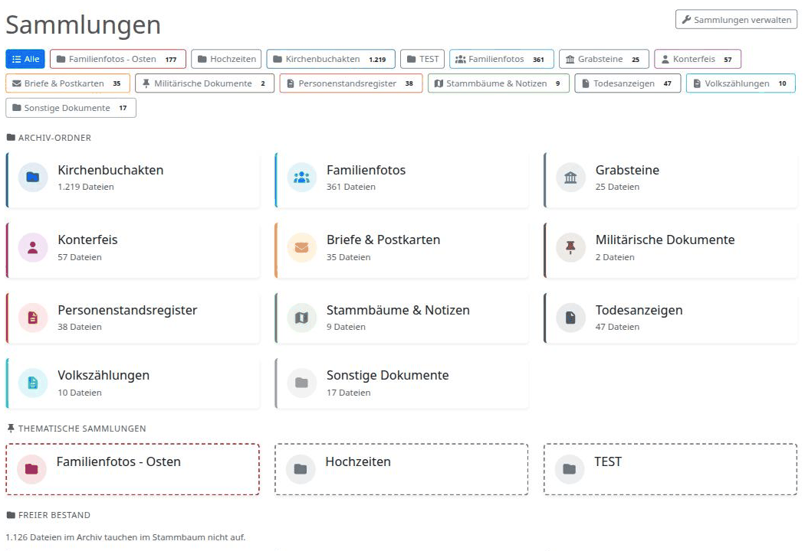
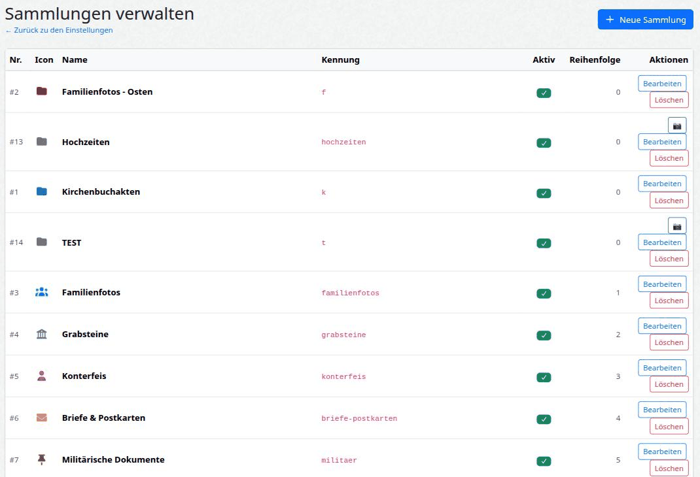

# Sammlungen – módulo personalizado para webtrees

[🇬🇧 English](README.md) · [🇩🇪 Deutsch](README.de.md) · [🇳🇱 Nederlands](README.nl.md) · 🇪🇸 **Español**

**Colecciones de fotos y documentos para [webtrees](https://webtrees.net) con enriquecimiento EXIF, galería, lightbox y sincronización bidireccional con los datos GEDCOM.**

| | |
|---|---|
| Nombre del módulo | `sammlungen` |
| Versión | 1.2.6 |
| webtrees | 2.2.x |
| PHP | 8.2 – 8.4 |
| Licencia | GPL-3.0-or-later |

---

## ¿Qué hace este módulo?

webtrees gestiona los objetos multimedia como parte del estándar GEDCOM, pero no
ofrece **colecciones visuales de fotos** con la profundidad que necesita un archivo
familiar. `Sammlungen` cubre exactamente esa carencia:

- **Galerías de fotos y documentos** agrupadas por temas (fotos de familia,
  lápidas, registros parroquiales, cartas, documentos militares, …)
- **Datos EXIF/XMP leídos y editados directamente en los archivos de imagen** – sin
  el rodeo de las etiquetas GEDCOM
- **Sincronización bidireccional** entre los metadatos de las fotos y los enlaces a
  personas de webtrees
- **Colecciones basadas en rutas** también para material que no es en absoluto un
  objeto GEDCOM del árbol (una parte deliberada del archivo, no una lista pendiente)

### ¿Por qué este módulo – y no simplemente la lista de medios de webtrees?

El punto de partida fue práctico: hacía tiempo que había sacado mis fotos privadas
de Google y compañía para volver a tenerlas bajo mi propio control. ¿Y el resto?
Viejas fotografías familiares, imágenes de las casas y granjas de los antepasados,
además de cartas, certificados y testamentos, declaraciones de herederos, permisos
de conducir y carnés de socio, papeles militares y de emigración, hasta viejas
grabaciones de audio y películas de cine. ¿Otro programa más, dedicado a esto? No.
Buena parte pertenece de todos modos a personas del árbol genealógico, otra parte se
sostiene por sí sola – pero todo pertenece al **único archivo familiar**. Y la
familia ya está ahí como usuaria de webtrees; con este módulo está automáticamente
también en el archivo. **Esa es la idea.**

La lista de medios es una herramienta de administración. `Sammlungen` es una
**experiencia de visualización** – y, sobre todo, **integrada en webtrees**, con todo
lo que eso conlleva:

- **Protegida por la gestión de usuarios de webtrees:** los miembros de la familia,
  una vez identificados, navegan por las galerías; los visitantes anónimos ven el
  árbol (con la privacidad protegida) pero **no** las colecciones. No construyes tu
  propio control de acceso – lo hace por ti el modelo de permisos por niveles, ya
  probado, de webtrees.
- **Tus datos siguen siendo tuyos – sin dependencia de un proveedor:** a diferencia
  de los "álbumes" de MyHeritage o Google Photos, tus fotos y sus descripciones
  siguen siendo enteramente tuyas. La **sincronización EXIF/XMP bidireccional**
  incluso vuelve a escribir la descripción, la fecha y las personas **dentro de los
  archivos de imagen** – los metadatos no viven solo en la base de datos, viajan con
  las fotos.
- **Fotos sin necesidad de asociarlas a una persona:** no tienen por qué colgar de
  personas individuales (nada de 30 fotos de la abuela enterradas en un solo perfil),
  y sin embargo permanecen cerca del contenido genealógico y del público que ya está
  en webtrees.

Doble beneficio: los mismos medios son **prueba genealógica** y a la vez una
**galería presentable y navegable** – tanto para mostrarla dentro de la familia como
para tu propio archivado y trabajo con metadatos.

### Vista general de colecciones

Vista general de todas las colecciones, agrupadas por carpetas de archivo y grupos
temáticos:



### Lightbox de fotos con editor EXIF

Al hacer clic en una foto se abre el lightbox con barra lateral – ver los EXIF,
editarlos y volver a escribir los cambios en el archivo (copia de seguridad diaria
automática antes de cada escritura):


La barra lateral muestra EXIF y XMP, permite editar descripción, fecha, personas y
palabras clave, compara los valores con los enlaces a personas de webtrees y ofrece
un botón de "incorporar" con un solo clic para cualquier diferencia.

### Listas de documentos

Las colecciones que contienen PDF/documentos (registros parroquiales, registros
civiles, …) se muestran automáticamente como lista en lugar de como cuadrícula de
fotos:


### Administración

Crea tus propias colecciones con nombre, icono, color y tipo de vista (galería de
fotos, lista de documentos, mixto). Estado activo con conmutador de un clic:



---

## Lista de funciones

- **Galerías** para colecciones de fotos (`Fotos de familia`, `Lápidas`, `Retratos`, colecciones propias)
- **Lightbox** con navegación por teclado, tira de miniaturas y barra lateral
- **Lectura EXIF/XMP** (descripción, fecha, personas, palabras clave) con caché de Imagick
- **Escritura EXIF/XMP** con copia de seguridad diaria automática antes de cada cambio
- **Sincronización EXIF ↔ webtrees** (descripción, personas) con incorporación de un clic
- **Renombrado de archivos** directamente desde el lightbox (la base de datos se actualiza de forma atómica)
- **Colecciones propias** (CRUD): nombre, slug, icono, color, vista
- **Asignación basada en rutas**: incluso las fotos no importadas pueden añadirse a colecciones
- **"Fondo libre"** como vista general aparte (parte del archivo familiar, no enlazada en el árbol)
- **Caché APCu** para consultas costosas con TTL configurable

## Requisitos

- webtrees ≥ 2.2.0
- PHP ≥ 8.2 con las extensiones: `imagick`, `gd`, `apcu` (opcional; si falta, se usa una caché en array)
- MariaDB / MySQL ≥ 10.5

## Instalación

### Opción A: ZIP de instalación (recomendada – sin Composer/git)

1. Descarga el `sammlungen-vX.Y.Z.zip` más reciente desde la
   [página de versiones](https://github.com/thobgg/webtrees-sammlungen/releases/latest).
2. Descomprímelo – obtienes una carpeta llamada `sammlungen/`.
3. Copia esa carpeta al directorio `modules_v4/` de tu instalación de webtrees
   (destino: `modules_v4/sammlungen/`).

### Opción B: mediante git + Composer (para desarrolladores)

```bash
cd modules_v4
git clone https://github.com/thobgg/webtrees-sammlungen.git sammlungen
cd sammlungen
composer install --no-dev
```

Después activa el módulo en webtrees en **Panel de control → Módulos → Módulos personalizados**.
Las tablas de la base de datos se crean automáticamente en la primera carga.

## Uso

1. **El menú "Colecciones"** en la navegación de webtrees abre la vista general.
2. **Haz clic en una colección** para abrir la galería (cuadrícula de fotos o lista de documentos).
3. **Haz clic en una foto** para abrir el lightbox con navegación por teclas de flecha.
4. **El icono del lápiz en el lightbox** abre la barra lateral con el editor EXIF.
5. El **área de administración** está accesible en `Panel de control → Módulos → Sammlungen → Preferencias`:
   - Crear / editar / eliminar colecciones propias
   - Configurar el TTL de la caché y el tamaño de página
   - Activar o desactivar el enlace del pie de página

## Llenar las colecciones con imágenes

Hay **dos tipos** de colecciones – la diferencia está únicamente en el campo
**"Carpeta multimedia" (Medienordner)** del formulario de la colección:

### 1. Colección por carpeta (recomendada, automática)

Indicas una carpeta bajo `data/media/` en el campo **"Carpeta multimedia"**
(p. ej. `grabsteine`). La colección entonces **contiene automáticamente todas las
imágenes** de esa carpeta (incluidas las subcarpetas) – los archivos nuevos aparecen
sin ninguna otra acción. Este es el camino habitual y el único que escala a fondos
grandes.

1. Crea una carpeta bajo `data/media/` (p. ej. `data/media/grabsteine/`) y coloca
   las imágenes dentro.
2. Crea una colección, escribe el nombre de la carpeta en **"Carpeta multimedia"**
   (`grabsteine`) y elige el tipo de visualización **"Galería de fotos"**.
3. Activa **"Visible (activo)"** y guarda. Listo – todas las imágenes se incluyen
   automáticamente.

### 2. Colección tipo álbum (curada a mano)

Si dejas **"Carpeta multimedia" vacía**, obtienes un álbum libre que rellenas a
mano: usa el **botón 📷** en la gestión de la colección para elegir imágenes
individuales.

Importante: el selector 📷 no ofrece archivos arbitrarios – solo muestra imágenes de
**colecciones por carpeta ya existentes** (camino 1), que actúan así como su
**fuente de imágenes**. Para que una colección por carpeta aparezca como fuente de
imágenes, debe cumplir las tres condiciones:

- está **marcada como visible** – el conmutador **"Visible (activo)"** de su
  formulario de edición está activado;
- tiene una **carpeta multimedia directamente bajo `data/media/`** – una carpeta sin
  `/` en el nombre (p. ej. `grabsteine`, no `grabsteine/2024`);
- su tipo de visualización es **"Galería de fotos"** o **"Cuadrícula de fotos"**.

Así, para un álbum manual necesitas primero **al menos una colección por carpeta de
ese tipo** (camino 1). Sin ella, el selector no tiene fuente de imágenes e informa
de que no hay imágenes disponibles.

> **Regla práctica:** ¿todas las imágenes de un tema están en una sola carpeta? →
> colección por carpeta (camino 1). ¿Quieres reunir imágenes sueltas de varias
> carpetas? → colección tipo álbum (camino 2).

## Arquitectura

```
sammlungen/
├── module.php                       ← punto de entrada de webtrees
├── composer.json                    ← manifiesto de Composer
├── src/
│   ├── SammlungenModule.php        ← clase principal del módulo (rutas, menú, migraciones)
│   ├── Cache/                       ← caché APCu con respaldo en array
│   ├── Dto/                         ← Data Transfer Objects (SammlungDto)
│   ├── Http/RequestHandlers/        ← manejadores PSR-15 (galería, admin, endpoints AJAX)
│   ├── Repository/                  ← acceso a la BD (SammlungenRepository)
│   ├── Service/                     ← lógica de negocio (CollectionService, ExifService)
│   └── ViewModel/                   ← preparación de datos (SammlungenViewModel)
├── resources/
│   ├── js/sammlung-galerie.js      ← lightbox + sync + renombrado + guardado EXIF
│   ├── views/ + partials/          ← plantillas PHP
│   └── lang/                        ← de.po, de.mo, en, ca, es, nl (traducciones)
└── docs/images/                     ← capturas para este README
```

## Rutas

Todas las URL están bajo `/tree/{tree}/archiv/…`:

| Nombre de ruta | URL | Método |
|---|---|---|
| `sammlungen.sammlungen` | `/sammlungen[?kategorie=slug]` | GET |
| `sammlungen.sammlung-medium` | `/sammlung-medium` | POST |
| `sammlungen.exif-schreiben` | `/exif-schreiben` | POST |
| `sammlungen.datei-umbenennen` | `/datei-umbenennen` | POST |
| `sammlungen.media-datei` | `/media-datei` | GET |
| `sammlungen.admin.sammlungen` | `/admin/sammlungen` | GET |
| `sammlungen.admin.sammlungen.edit` | `/admin/sammlungen/edit` | POST |
| `sammlungen.admin.sammlungen.toggle-aktiv` | `/admin/sammlungen/toggle-aktiv` | POST |
| `sammlungen.admin.config` | `/admin/config` | POST |

## Modelo de datos

```sql
sammlungen_collection           -- definiciones: nombre, slug, icono, color, vista, carpeta
sammlungen_collection_medium    -- N:M medio webtrees ↔ colección (por m_id)
sammlungen_collection_pfad      -- N:M ruta ↔ colección (también imágenes no importadas)
```

## Configuración

Disponible en la interfaz de administración:

- **TTL de la caché** (por defecto: 900 s)
- **Tamaño de página** (por defecto: 50)
- **Mostrar enlace en el pie** (sí/no)

## Localización

La interfaz está disponible en **alemán**, **inglés**, **catalán**, **español** y (parcialmente) **neerlandés**.
Los archivos de traducción están en `resources/lang/` (`de`, `en`, `ca`, `es`, `nl`). Los textos fuente
van envueltos en `I18N::translate()` y el alemán es el idioma de origen.

Se agradecen las contribuciones: copia `resources/lang/nl.po` (una plantilla completa y
actualizada), traduce las entradas `msgstr` vacías, compila con `msgfmt nl.po -o nl.mo` y
abre un pull request. Idiomas nuevos: parte de `en.po` como base y nómbralo `<código>.po`.

## Módulos relacionados

| Módulo | Función |
|---|---|
| [Ortsregister](https://github.com/thobgg/webtrees-ortsregister) | Módulo hermano para páginas visuales de lugares y vinculación foto-lugar |

## Licencia

GPL-3.0-or-later, igual que webtrees. Véase [LICENSE](LICENSE).

## Autor y soporte

Thomas Bugge · thomas@bgg-mail.de  
Preguntas / errores: GitHub Issues

Traducción de la interfaz al catalán y al español: Bernat Josep Banyuls i Sala 🇪🇸  
Traducción de la interfaz al eslovaco: Ladislav Rosival 🇸🇰
